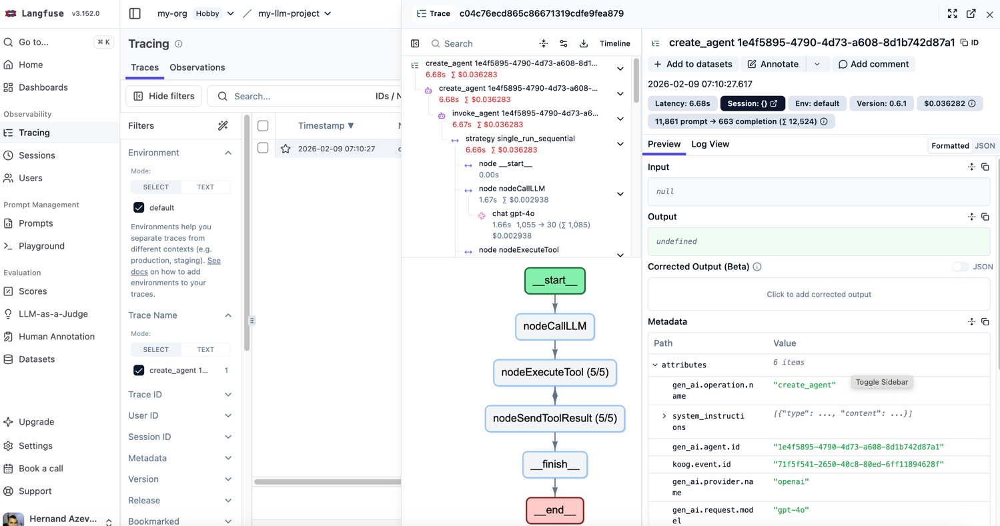

# Kotlin AI Agent with Koog Framework

A production-ready multiplatform AI agent built with Kotlin Multiplatform (KMP) and JetBrains Koog framework, following best practices from the official [JetBrains AI blog series](https://blog.jetbrains.com/ai/2025/11/building-ai-agents-in-kotlin-part-2-a-deeper-dive-into-tools/).



## Features

- **Kotlin Multiplatform**: Built with KMP for cross-platform support
- **Koog Best Practices**: Implements patterns from JetBrains' official AI agent framework guide
- **Project Exploration**: Lists directories and files with validation
- **Code Reading**: Reads and analyzes files with detailed metadata
- **Code Editing**: Modifies files with confirmation handlers and safety checks
- **Shell Command Execution**: Runs build tools, tests, and scripts with timeout support
- **Git Operations**: Status, diff, commit, branch management via MCP
- **OpenAI Integration**: Uses GPT-4o for intelligent decision-making
- **MCP Integration**: Extensible tool system using Model Context Protocol
- **Configurable Safety**: Brave mode for automation, safe mode for interactive use
- **Timeout Handling**: Partial output preservation for long-running commands
- **Parameter Validation**: Input validation with helpful error messages
- **Observability**: Full tracing with Langfuse and OpenTelemetry for debugging and cost tracking
- **Sub-Agents**: Specialized agents for focused tasks like code search
- **Memory Management**: History compression for long-running tasks with intelligent context preservation
- **Multi-Executor**: Support for multiple LLM providers (OpenAI + Anthropic) with optimal model selection

## Available Tools

### File System Tools (Koog SimpleTool)

Following JetBrains Koog naming convention (double underscore format):

1. **list__directory**: Lists all files and directories in a path
   - Input validation for security (blocks `..`, empty paths)
   - Returns file count and formatted list

2. **read__file**: Reads file contents with metadata
   - Provides line count and character count
   - Formatted code block output
   - Path validation

3. **create__file**: Creates new files with specified content
   - Confirmation handler for safety
   - Content size validation (max 1MB)
   - Returns creation status with metadata

4. **edit__file**: Modifies existing files by replacing content
   - Confirmation handler with overwrite awareness
   - Content validation
   - Suggests reading file first before editing

5. **execute__shell_command**: Executes shell commands with timeout support
   - Platform-agnostic (Windows: cmd.exe, Unix: /bin/sh)
   - Configurable timeout (default: 30s)
   - Partial output preservation on timeout
   - Working directory support
   - Confirmation handler for dangerous operations

### Git Tools (via MCP Server)

Automatically discovered when MCP server is running:

- **git_status**: Show the working tree status
- **git_diff**: Show changes between commits, commit and working tree
- **git_commit**: Record changes to the repository
- **git_log**: Show commit logs
- **git_branch**: List, create, or delete branches
- **git_checkout**: Switch branches or restore working tree files
- **git_add**: Add file contents to the staging area
- **git_push**: Update remote refs along with associated objects

**Note**: Git tools are automatically discovered when the MCP Git Server is running. If the server is unavailable, the agent falls back to file system tools only.

## Prerequisites

- JDK 17 or higher
- Gradle
- OpenAI API Key
- (Optional) [MCP Git Server](https://github.com/hernandazevedo/mcp-git-server) running for Git operations

## Setup

1. Clone the repository

2. Configure your OpenAI API key:
```bash
export OPENAI_API_KEY="your-api-key-here"
```

Or create a `.env` file:
```
OPENAI_API_KEY=your-api-key-here
```

3. Build the project:
```bash
./gradlew build
```

4. Run tests (optional):
```bash
./gradlew test
```

4. (Optional) Start the MCP Git Server for Git operations:

First, clone and setup the [MCP Git Server](https://github.com/hernandazevedo/mcp-git-server):
```bash
git clone https://github.com/hernandazevedo/mcp-git-server.git
cd mcp-git-server
chmod +x mcp-git-server.sh
```

Then start the server:
```bash
# In a separate terminal
./gradlew run
# or
./mcp-git-server.sh http
```

The MCP server will start on `http://localhost:8080` by default.

## Usage

Run the agent by providing the project path and task:

```bash
./gradlew jvmRun --args="/path/to/project 'Your task here'"
```

### Brave Mode

Enable brave mode to auto-approve all operations (useful for automation):

```bash
./gradlew jvmRun --args="/path/to/project 'Your task here' --brave"
```

### Examples

```bash
# Add a new function
./gradlew jvmRun --args="/Users/username/my-project 'Add a function to calculate Fibonacci numbers'"

# Refactor code
./gradlew jvmRun --args="/Users/username/my-project 'Refactor the UserService class to use dependency injection'"

# Fix bugs with brave mode
./gradlew jvmRun --args="/Users/username/my-project 'Fix the bug in the authentication method' --brave"

# Build and test (uses execute__shell_command)
./gradlew jvmRun --args="/Users/username/my-project 'Run the build and fix any compilation errors' --brave"

# With Git operations (requires MCP server running)
./gradlew jvmRun --args="/Users/username/my-project 'Fix the calculator bug and commit the changes with a descriptive message'"

# Check git status
./gradlew jvmRun --args="/Users/username/my-project 'Check the git status and tell me what files have changed'"

# Complex workflow with timeout
./gradlew jvmRun --args="/Users/username/my-project 'Run tests, analyze failures, and create a bug report file' --brave"
```

## Architecture

### Main Components

- **AIAgent (Koog)**: Orchestrates the main execution loop with enhanced system prompts
- **simpleOpenAIExecutor (Koog)**: Interfaces with the OpenAI API (GPT-4o)
- **SimpleTool (Koog)**: Base class for creating tools with Args/Result pattern
- **FileSystemProvider**: Abstraction for file system operations (KMP compatible)
- **FileSystem**: Platform-specific implementations (expect/actual pattern)
- **Sub-Agents**: Specialized agents for focused tasks (see [Sub-Agents Documentation](docs/SUBAGENTS.md))
- **Memory Management**: History compression for long-running tasks (see [Memory Documentation](docs/MEMORY.md))
- **Multi-Executor**: Use multiple LLM providers for optimal cost/quality balance (see [Multi-Executor Documentation](docs/MULTI_EXECUTOR.md))

### Koog Best Practices Components

Following patterns from [JetBrains AI blog](https://blog.jetbrains.com/ai/2025/11/building-ai-agents-in-kotlin-part-2-a-deeper-dive-into-tools/):

- **ConfirmationHandler**: Interface for confirming potentially dangerous operations
  - `BraveConfirmationHandler`: Auto-approves all operations (automation mode)
  - `SafeConfirmationHandler`: Safety checks (interactive mode)
- **ToolValidation**: Input parameter validation utilities
  - Path validation (security checks, prevents `..`)
  - Content validation (size limits, empty checks)
- **ShellCommandResult**: Structured result class for command execution
  - Exit code tracking
  - Timeout status preservation
  - Partial output capture

### MCP Integration Components

- **McpClient**: HTTP client for JSON-RPC communication with MCP servers
- **McpProtocol**: Data classes implementing MCP 2024-11-05 specification
- **McpToolAdapter**: Bridges MCP tools to Koog's SimpleTool interface
- **McpToolDiscovery**: Auto-discovers and registers tools from MCP servers

### Project Structure

```
src/
├── commonMain/kotlin/com/agents/
│   ├── FileSystemProvider.kt           # Common interface
│   ├── config/
│   │   └── ConfirmationHandler.kt      # Safety confirmation system
│   ├── validation/
│   │   └── ToolValidation.kt           # Parameter validation
│   └── tools/
│       └── FileSystemTools.kt          # File system SimpleTool implementations
└── jvmMain/kotlin/com/agents/
    ├── FileSystemProvider.jvm.kt       # JVM implementation
    ├── Main.kt                         # Entry point with Koog AIAgent
    ├── tools/
    │   └── ShellCommandTool.jvm.kt     # Shell command execution with timeout
    └── mcp/
        ├── McpClient.kt                # HTTP client for MCP
        ├── McpProtocol.kt              # MCP 2024-11-05 protocol
        ├── McpToolAdapter.kt           # MCP → Koog adapter
        └── McpToolDiscovery.kt         # Tool auto-discovery
```

### Execution Flow

1. **Initialization**: Agent initializes with Koog's AIAgent
2. **Mode Selection**: Choose brave mode (--brave) or safe mode
3. **Confirmation Setup**: Configure appropriate ConfirmationHandler
4. **Tool Registration**: Register file system tools with validation
5. **MCP Discovery**: Connect to MCP server (if available) and auto-discover Git tools
6. **Task Processing**: Receive task and project path
7. **Exploration**: Explore project using `list__directory` with validation
8. **Analysis**: Read relevant files with `read__file`
9. **Validation**: Validate all inputs before operations
10. **Confirmation**: Request approval for write/shell operations (if not in brave mode)
11. **Execution**: Execute modifications via `create__file`, `edit__file`, or `execute__shell_command`
12. **Timeout Handling**: Handle long-running commands with partial output preservation
13. **Git Operations**: (Optional) Perform Git operations via MCP tools
14. **Result Formatting**: Return structured results with helpful error messages
15. **Summary**: Provide clear summary of changes made

## Testing

The project includes comprehensive test coverage following JetBrains Koog best practices:

### Running Tests

```bash
# Run all tests
./gradlew test

# Run only JVM tests
./gradlew jvmTest

# Run tests with detailed output
./gradlew test --info
```

### Test Coverage

**58 tests total** covering:

1. **ConfirmationHandler Tests** (4 tests)
   - BraveConfirmationHandler approval behavior
   - SafeConfirmationHandler approval behavior
   - Both approve and reject scenarios

2. **ToolValidation Tests** (11 tests)
   - Path validation (empty, blank, path traversal attacks)
   - Content validation (empty, size limits, special characters)
   - Security checks

3. **FileSystemTools Tests** (16 tests)
   - ListDirectoryTool: success, empty, invalid paths, security
   - ReadFileTool: success, multiline files, file not found
   - CreateFileTool: success, rejection, validation, permissions
   - EditFileTool: success, rejection, security, large content

4. **ShellCommandTool Tests** (11 tests)
   - Simple commands (echo, ls/dir)
   - Empty command and invalid timeout validation
   - Confirmation rejection
   - Working directory support
   - Command failure handling (exit codes)
   - Timeout with partial output preservation
   - Multiline output
   - Result data structure

5. **MCP Protocol Tests** (16 tests)
   - JSON-RPC request/response serialization
   - Error handling structures
   - Tool definitions
   - Server info and capabilities
   - Tool list and call results

### Test Structure

```
src/
├── commonTest/kotlin/com/agents/
│   ├── config/
│   │   └── ConfirmationHandlerTest.kt
│   ├── validation/
│   │   └── ToolValidationTest.kt
│   └── tools/
│       └── FileSystemToolsTest.kt
└── jvmTest/kotlin/com/agents/
    ├── tools/
    │   └── ShellCommandToolTest.kt
    └── mcp/
        └── McpProtocolTest.kt
```

### Mock Objects

Tests use mock implementations for isolation:
- `MockFileSystemProvider`: For testing file operations without real I/O
- `MockConfirmationHandler`: For testing approval/rejection flows
- Platform-agnostic shell commands for cross-platform testing

## Observability

This project implements comprehensive observability using **Langfuse** and **OpenTelemetry**, following the patterns from [JetBrains Koog blog Part 3: Under Observation](https://blog.jetbrains.com/ai/2025/12/building-ai-agents-in-kotlin-part-3-under-observation/).

### Features

- **Full Trace Visibility**: Track every LLM call, tool execution, and agent decision
- **Cost Tracking**: Monitor token usage and costs per run
- **Session Grouping**: Group related agent runs for analysis
- **Performance Metrics**: Measure execution time for each operation
- **Tool Call Logging**: See arguments and results for every tool call

### Setup Langfuse

1. Create a free account at [cloud.langfuse.com](https://cloud.langfuse.com)
2. Generate API keys from your project settings
3. Add to `.env` file:

```bash
LANGFUSE_PUBLIC_KEY=pk-lf-...
LANGFUSE_SECRET_KEY=sk-lf-...
LANGFUSE_BASE_URL=https://us.cloud.langfuse.com
```

### How It Works

When Langfuse is configured, the agent automatically:
- Generates a unique session ID for each run (`agent-run-xxxxxxxx`)
- Tracks all OpenAI API calls with token usage
- Records tool executions with parameters and results
- Exports traces to Langfuse for visualization
- Logs detailed information to console (when verbose mode is enabled)

### Viewing Traces

After running the agent, visit your Langfuse dashboard to:
- View the complete execution graph
- Analyze token usage and costs
- Debug tool call sequences
- Compare runs using session IDs
- Export data for evaluation

### Console Output Example

```
[Observability] Langfuse tracking enabled - Session ID: agent-run-b46626d0
...
INFO: 'chat gpt-4o' : ...
  gen_ai.usage.input_tokens=1053
  gen_ai.usage.output_tokens=31
...
INFO: 'execute_tool list__directory' : ...
  gen_ai.tool.call.result="Contents of '/path' (2 items)..."
```

### Disabling Observability

Simply don't set the Langfuse environment variables. The agent will detect this and run without observability:

```
[Observability] Langfuse not configured - skipping telemetry
```

## Configuration

### Environment Variables

- `OPENAI_API_KEY`: Your OpenAI API key (required)
- `LANGFUSE_PUBLIC_KEY`: Langfuse public API key (optional, for observability)
- `LANGFUSE_SECRET_KEY`: Langfuse secret API key (optional, for observability)
- `LANGFUSE_BASE_URL`: Langfuse server URL (optional, default: `https://us.cloud.langfuse.com`)
- `MCP_SERVER_URL`: MCP server URL (default: `http://localhost:8080/mcp`)
- `GIT_WORKING_DIR`: Working directory for Git operations on MCP server side

### Example Configuration

```bash
export OPENAI_API_KEY="sk-..."
export MCP_SERVER_URL="http://localhost:8080/mcp"
export GIT_WORKING_DIR="/path/to/repo"
```

## Technology Stack

- **Kotlin Multiplatform**: Cross-platform development
- **Koog 0.6.1**: JetBrains AI agent framework
  - `koog-agents`: Core agent functionality
  - `agents-features-opentelemetry`: Observability support
  - `agents-features-trace`: Tracing capabilities
- **OpenAI GPT-4o**: Language model for intelligent decisions
- **Langfuse**: Observability and tracing platform
- **OpenTelemetry**: Industry-standard observability framework
- **OkHttp**: HTTP client for MCP communication
- **kotlinx.serialization**: JSON serialization
- **kotlinx.coroutines**: Asynchronous programming

## Koog Best Practices Implementation

This project implements the patterns and best practices from the official JetBrains AI blog series:

### Tool Structure
- ✅ **Double underscore naming**: All tools follow `tool__name` convention
- ✅ **Args classes**: Serializable parameter classes for type safety
- ✅ **Result classes**: Structured outputs (e.g., `ShellCommandResult`)
- ✅ **Clear descriptions**: LLM-friendly tool documentation

### Safety & Validation
- ✅ **ConfirmationHandler**: Configurable approval system for dangerous operations
- ✅ **Input validation**: Path and content validation before execution
- ✅ **Error handling**: Meaningful error messages with actionable suggestions
- ✅ **Security checks**: Prevents path traversal (`..`), validates sizes

### Advanced Features
- ✅ **Timeout handling**: Commands respect timeout with partial output preservation
- ✅ **Platform-agnostic**: Shell commands work on Windows and Unix systems
- ✅ **Configurable modes**: Brave mode for automation, safe mode for interactive use
- ✅ **Detailed feedback**: Line counts, file sizes, exit codes in results

### System Prompt Engineering
- ✅ **Clear guidelines**: Step-by-step approach for the AI agent
- ✅ **Definition of done**: Explicit completion criteria
- ✅ **Error recovery**: Instructions for handling failures
- ✅ **Tool usage patterns**: Examples of when to use each tool

### Observability
- ✅ **OpenTelemetry integration**: Full trace visibility into agent execution
- ✅ **Langfuse support**: Cloud-based observability platform
- ✅ **Session tracking**: Unique IDs for grouping related runs
- ✅ **Cost tracking**: Monitor token usage and API costs
- ✅ **Tool call tracing**: Detailed logging of all tool executions
- ✅ **Automatic detection**: Gracefully degrades when observability is not configured

## Advantages of KMP + Koog Migration

1. **Multiplatform Support**: Can now target JVM, JS, WasmJS, Android, and iOS
2. **Enterprise-Ready**: Built on JetBrains' proven AI framework following official best practices
3. **Type-Safe Tools**: Koog provides type-safe tool definitions with Args/Result pattern
4. **Better Reliability**: Built-in retries, fault-tolerance, and timeout handling
5. **Observability**: Native support for tracing and monitoring
6. **Maintainability**: Cleaner architecture with Koog's DSL and validation system
7. **Production-Ready**: Implements real-world patterns from JetBrains blog series

## MCP Integration Details

This project implements **Full MCP Client Integration with Koog**, which:

- Follows the [Model Context Protocol](https://modelcontextprotocol.io/) specification (2024-11-05)
- Uses JSON-RPC 2.0 over HTTP for communication
- Auto-discovers tools from MCP servers at startup
- Adapts MCP tools to Koog's SimpleTool interface
- Gracefully degrades when MCP server is unavailable
- Supports multiple MCP servers (extensible architecture)

### Tool Discovery Process

1. Agent starts and attempts to connect to MCP server
2. Sends `initialize` request to establish connection
3. Sends `tools/list` request to discover available tools
4. Creates McpToolAdapter instances for each tool (wrapping as Koog SimpleTool)
5. Registers tools with the Koog agent
6. Tools are now available for the AI to use

## Limitations

- Git operations require MCP Git Server to be running
- Requires a valid OpenAI API key
- Write operations require read-write FileSystemProvider
- Shell command execution is JVM-only (other platforms need platform-specific implementations)
- Interactive confirmation mode not yet implemented (currently only brave mode or auto-approve)

## Next Steps

- [ ] Add interactive confirmation prompts for safe mode
- [ ] Implement shell command tool for other platforms (JS, Native)
- [ ] Add retry logic with exponential backoff for failed operations
- [ ] Add more MCP servers (database, API tools, etc.)
- [ ] Create comprehensive integration tests for timeout scenarios
- [ ] Add support for more LLMs (Claude, Gemini)
- [ ] Implement tool usage analytics and observability
- [ ] Add file diff support for safer editing
- [ ] Create web UI for interactive agent control

## References

### Official Documentation
- [Koog Framework Documentation](https://docs.koog.ai/)
- [JetBrains Koog GitHub](https://github.com/JetBrains/koog)
- [Building AI Agents in Kotlin - Part 2: A Deeper Dive into Tools](https://blog.jetbrains.com/ai/2025/11/building-ai-agents-in-kotlin-part-2-a-deeper-dive-into-tools/) ⭐ **Tool implementation patterns**
- [Building AI Agents in Kotlin - Part 3: Under Observation](https://blog.jetbrains.com/ai/2025/12/building-ai-agents-in-kotlin-part-3-under-observation/) ⭐ **Observability implementation**
- [Building AI Agents in Kotlin - Part 4: Delegation and Sub-Agents](https://blog.jetbrains.com/ai/2026/01/building-ai-agents-in-kotlin-part-4-delegation-and-sub-agents/) ⭐ **Sub-agent architecture**
- [Building AI Agents in Kotlin - Part 5: Teaching Agents to Forget](https://blog.jetbrains.com/ai/2026/01/building-ai-agents-in-kotlin-part-5-teaching-agents-to-forget/) ⭐ **Memory management**

### Observability & Monitoring
- [Langfuse Documentation](https://langfuse.com/docs)
- [Langfuse Cloud](https://cloud.langfuse.com)
- [OpenTelemetry](https://opentelemetry.io/)

### Protocols & Standards
- [Model Context Protocol Specification](https://modelcontextprotocol.io/)
- [MCP Git Server](https://github.com/hernandazevedo/mcp-git-server)

### Related Technologies
- [Kotlin Multiplatform](https://kotlinlang.org/docs/multiplatform.html)
- [OpenAI API](https://platform.openai.com/docs/api-reference)

## License

Apache 2.0 (following Koog framework license)
